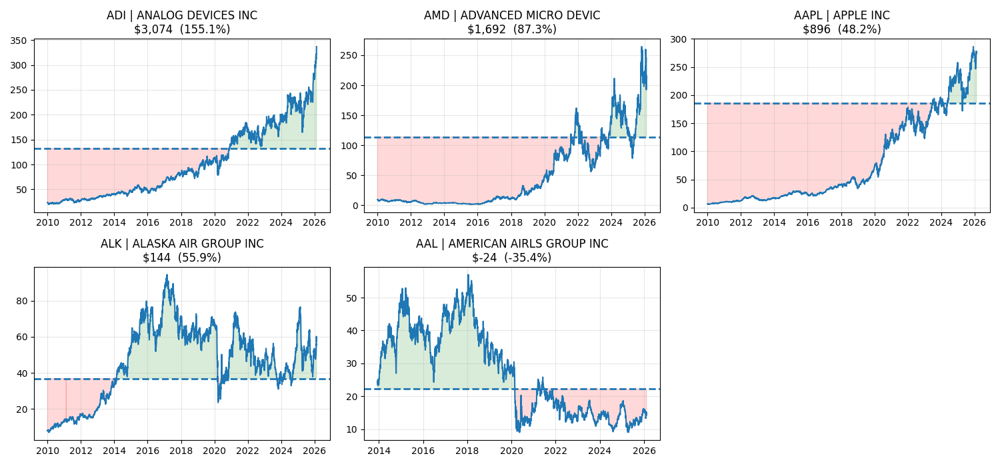

1. Use dummy_positions.csv as a guide
2. gics_sector_s_and_p.csv is from (https://en.wikipedia.org/wiki/List_of_S%26P_500_companies), so a pinch of salt is required. More robust lists coming soon.
3. charles_schwab.py is for auth into schwab accounts.

